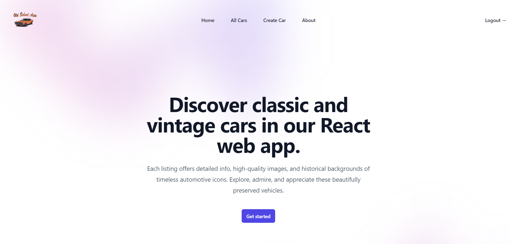
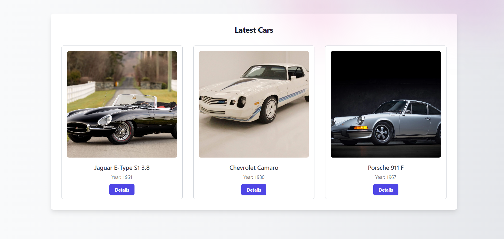
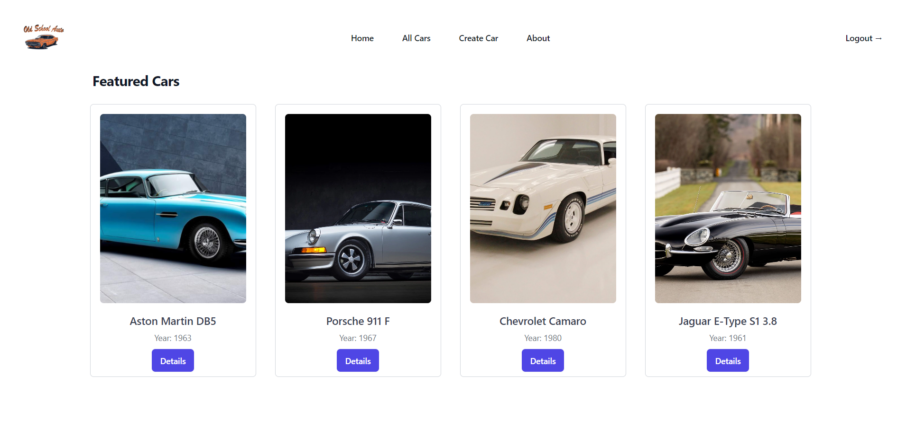
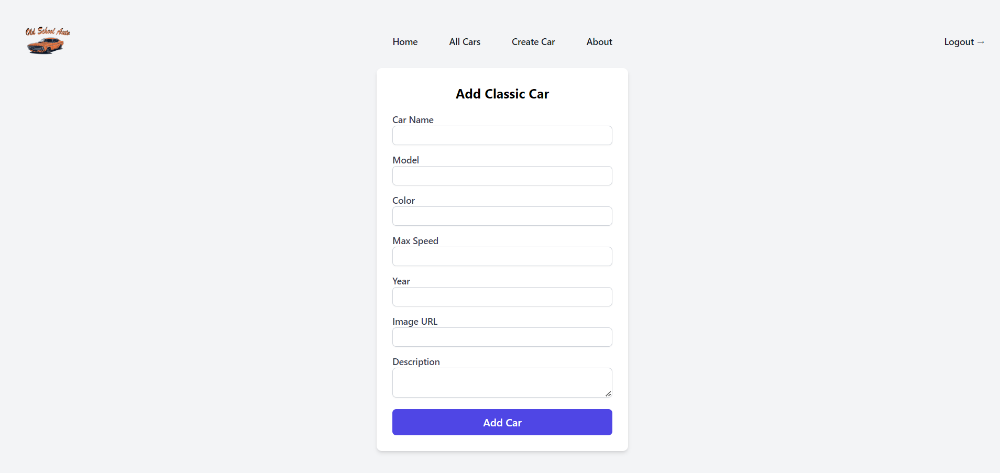
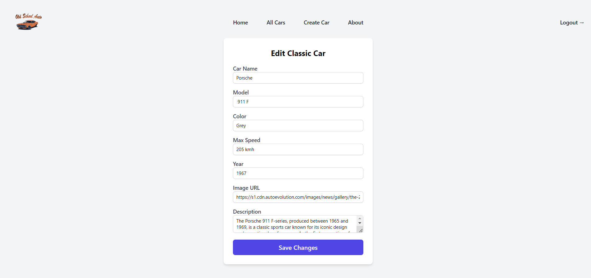
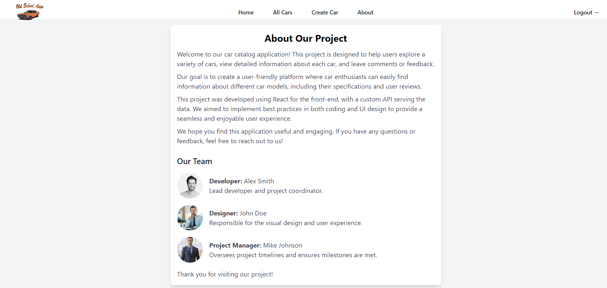
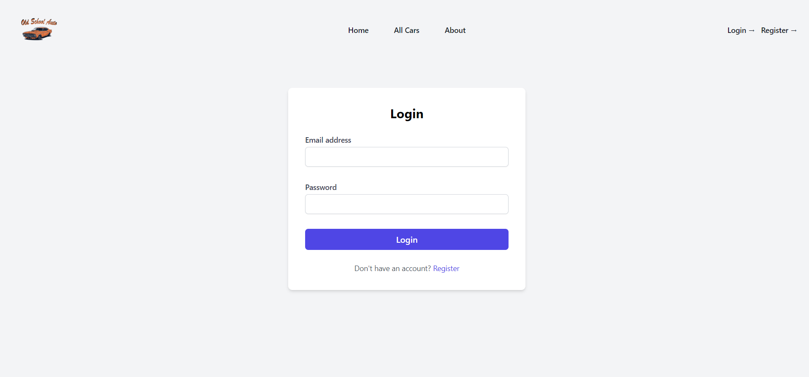
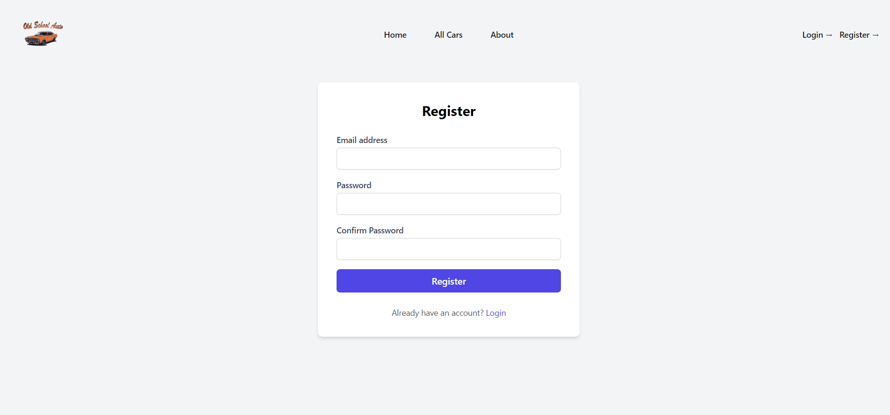

# ClassicOldCars React Project

### A React-based application that allows users to manage and view car information, including adding, editing, and viewing comments on individual cars. The application also supports user authentication with login, registration, and logout functionalities.

## Features

### Authentication
- **Register:** Create a new user account with email and password.
- **Login:** Access the application by logging in with registered credentials.
- **Logout:** End the user session to secure the application.
- **Protected Routes:** Certain functionalities and pages are accessible only to authenticated users.

### Car Management
- **View Cars:** Browse a list of classic cars with essential details.
- **Car Details:** View detailed information about each car.
- **Add Car:** Create new car entries with relevant details (authentication required).
- **Edit Car:** Modify existing car entries (authentication required).
- **Delete Car:** Remove a car entry from the list (authentication required).

### Comments
- **Add Comments:** Authenticated users can add comments to car details.
- **View Comments:** See comments associated with each car.

## Screenshots

Here are some screenshots of the ClassicOldCars application:

### Home Page

### Latest Cars

### All Cars

### Create Car

### Edit Car

### About Page

### Login Page

### Register Page

### Installation

1. **Clone the Repository:** The command to copy the project from GitHub to your local machine.
You can view and clone the repository from GitHub here: 
[ClassicOldCars Repository](https://github.com/vasilenaph/react-project-2024)
2. **Client Setup:**
   - Navigate into the `client` directory.
   - npm install
   - npm run dev
   - Start the client-side application.
3. **Server Setup:**
   - Open a new terminal window.
   - Navigate into the `server` directory.
   - node server.js
   - Start the server-side application.
4. **Access the Application:** Open the specified URL in a web browser to interact with your application.